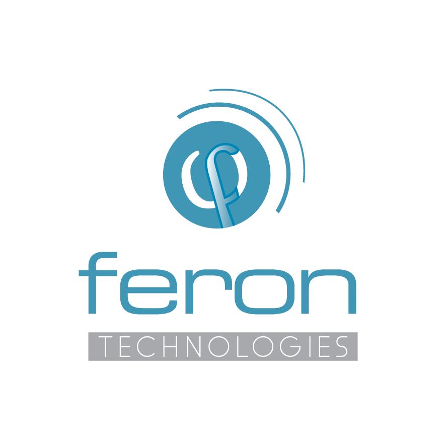

## Welcome to the *lte-sidelink* project page

*lte-sidelink* is an open software library developed in MATLAB by [Feron Technologies P.C.](http://www.feron-tech.com), that implements the functionalities of the 3GPP LTE sidelink interface, including physical signals, physical channels, transport channels, radio protocol procedures, and transceiver operations. It is applicable to both D2D and V2X use-cases.

### Introduction
Sidelink is an LTE feature first introduced in 3GPP Release 12 aiming at enabling device-to-device (**D2D**) communications within legacy cellular-based LTE radio access networks. Sidelink has been enriched in Releases 13 and 14 with various features. D2D is applicable to public safety and commercial communication use-cases, and recently (Rel.14) to vehicle-to-everything (**V2X**) scenarios. In legacy uplink/downlink, two UEs communicate through the Uu interface and data are always traversing the LTE eNB. Differently, sidelink enables the direct communication between proximal UEs using the newly defined PC5 interface, and data does not need to go through the eNB. Services provided in this way are often called "Proximity Services" (or ProSe) and the UEs suppporting this feature "ProSe"-enabled UEs.

The library provides an (almost) complete implementation of the sidelink physical signals, physical channels, transport layer, and radio resources allocation operations described in the 3GPP standard. In addition it provides the necessary transceiver processing functionalities for generating and/or recovering a real sidelink signal which is either simulated/emulated or sent over the air and captured by an SDR board. The code is highly-modular and documented in order to be easily understood and further extended.

The library has many usages. Typical use-case examples are the following:
* LTE sidelink waveform generator, supporting both D2D and V2X signals.
* End-to-end sidelink link-level simulator.
* Core component of a sidelink system-level simulator.
* Platform for testing new resource allocation/scheduling algorithms for D2D/V2X communications.
* Tool to experiment with live standard-compliant sidelink signals with the help of SDR boards.

The following 3GPP standard documents have been used and referenced through the code:
* 36.211 Physical channels and modulation (Section 9)
* 36.212 Multiplexing and channel coding (Section 5.4)
* 36.213 Physical layer procedures (Sections 5.2.2.25, 5.2.2.26, 5.10, 14)
* 36.321 Medium Access Control (MAC) protocol specification (Sections 5.14, 5.15, 5.16)
* 36.331 Radio Resource Control (RRC); Protocol specificatiοn (Sections 6.5.2, 6.3.8)

Further details for the 3GPP D2D/V2X standardization and implementation could be found in the following material:
* 22.803 Feasibility study for Proximity Services (ProSe) [Rel.12]
* 36.843 Study on LTE Device to Device Proximity Services - D2D Radio Aspects [Rel.12]
* 36.877 Study on LTE Device to Device Proximity Services - D2D User Equipment (UE) radio transmission and reception [Rel.12]
* 23.285 Architecture enhancements for V2X services [Rel.14]
* Rohde&Schwarz Device to Device Communication in LTE Whitepaper [Application Note 1MA264](https://www.rohde-schwarz.com/gr/applications/device-to-device-craommunication-in-lte-white-paper_230854-142855.html)

### Features
#### Supported Features
* Sidelink air-interface compliant with:
  * "Standard" D2D based on Rel.12 and Rel.13
  * D2D tweaks for V2X communications based on Rel.14
* Broadcast transport & physical channel processing functionalities
  * Generation and recovery of MIB-SL messages
  * Encoding and recovery of the SL-BCH transport channel
  * Encoding and recovery of the PSBCH physical channel
  * Demodulation Reference Signals (DMRS) construction and loading
* Sidelink discovery mode
  * Physical Signals and Channels: SL-DCH, PSDCH, PSDCH DMRS
  * Subframe/PRB discovery pool formation & UE-specific resource allocation
* Sidelink communication mode ("under development")
  * Physical Signals and Channels for Control Signaling: SCI Format 0, PSCCH, SL-SCH, PSSCH, PSCCH DMRS
  * Physical Signals and Channels for Payload : SL-SCH, PSSCH, PSSCH DMRS
  * Subframe/PRB communication pool formation & UE-specific resource allocation
* V2X sidelink communication mode  ("under development")
  * Physical Signals and Channels for L1 signaling: SCI Format 1 (V2V), PSCCH, PSCCH DMRS
  * Physical Signals and Channels for Payload: V2X PSSCH, PSSCH DMRS
  * Subframe/PRB pool formation & UE-specific resource allocation for V2X communication
* Synchronization preambles (PSSS, SSSS) construction & recovery
* Subframe creation, loading and time-domain signal transformation
* Complete receiver processing functionality for sidelink-compliant waveforms
  * time-synchronization
  * frequency-offset estimation and compensation
  * channel estimation and equalization
  * signal demodulation/decoding
* Implementation of all generic physical layer functionalities (CRC, Coding, Rate Matching, Modulation, Transform Precoding, Interleaving, Golden Sequence)
* Example scripts for configuring and running full sidelink broadcast, discovery, and communication transceiver simulation scenarios

### Repository Structure
* The **core/** directory includes sidelink-specific functionalities, i.e. physical/transport channel, DMRS, synchronization, channel estimator) organized in classes.
* The **lib/** directory includes generic (non-sidelink specific) tx/rx functionalities organized in functions, i.e. signal, physical and transport channel blocks, necessary for core classes implementation.
* The **test-scripts/** directory includes scripts for end-to-end testing of sidelink functionality, accompanied with extensive documentation.

#### Dependencies/Notes
* All functionalities are developed in-house except for: i) CRC encoding/detection, ii) Convolutional and Turbo Encoding/Decoding. For these, the corresponding MATLAB Communication Toolbox System Objects have been used. In-house versions of these two blocks will be also provided soon.
* Testing of the code has been done in MATLAB R2016b.

### Acknowledgements
Part of the activities leading to the first version of the library received funding from the European Union’s Seventh Framework Programme under grant agreement no 612050, ["FLEX Project"](http://www.flex-project.eu/), and in particular FLEX Open Call 2 Project [“FLEX-D: Experimenting with Flexible D2D communications Over LTE”](http://www.flex-project.eu/open-calls/2nd-open-call/results). FLEX-D carried out by Feron Technologies and University of Piraeus Research Centre, Greece, from April 2016 to April 2017. Since then the library has been maintained by Feron Technologies. From October 2017, further developments are also partially funded from Fed4Fire+ Open Call 2 Project ["FIVE"](https://www.fed4fire.eu/) and RAWFIE Open Call 2 Project ["PARROT"](http://www.rawfie.eu/).

### Support

:envelope: Drop us an e-mail if you are interested in using/extending the library or you need further clarifications on the configuration/execution of the examples.

