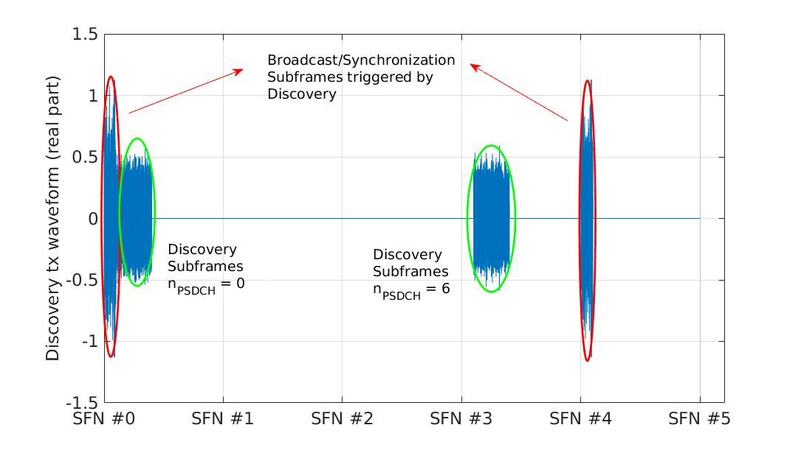
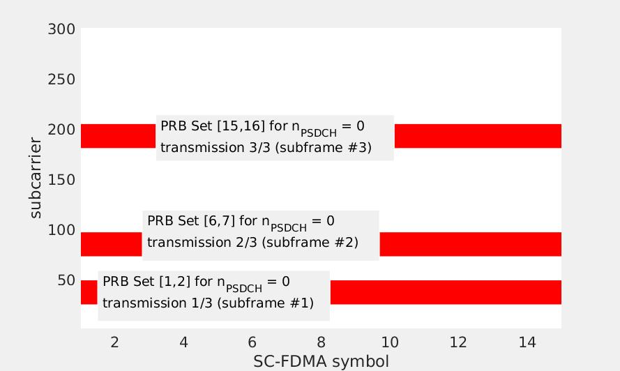

### Example Use of the Library: Sidelink discovery transceiver simulation

#### A short introduction to D2D Discovery
The sidelink discovery mode is used for sending (in a broadcast way) short messages to neighbor UEs. Protocol processing is extremely light; in essence each message corresponds to a single PHY transport block, containing no higher-layer additional overhead. How to fill the transport block is left open, and depends on the underlying D2D application. To support timing reference recovery at the monitoring D2D UEs, the announcing D2D UE(s) trigger the transmission of broadcast/synchronization subframes as described in the corresponding broadcast example. The sidelink discovery transmission/reception procedure involves two key functionalities:
* Selection of time (subframes) and frequency (PRBs) resources for announcing/monitoring discovery messages. Sidelink resource allocation is realized in two levels:
  * *inter sidelink-uplink level*, responsible for the determination of sidelink resource pools to avoid conflict with resources used for regular uplink transmissions.
  * *intra-sidelink level*, responsible for the determination of UE-specific resources, based on the configured sidelink resource pool(s). For receiving D2D UEs, multiple resources may be monitored in order to "listen" for simultaneous discovery announcements.
* L1 processing, i.e. signal generation (for tx) and transport block recovery operations (for rx). The processing includes:
  * Transport channel processing (SL-DCH);
  * Physical channel processing (PSDCH) assisted by PSDCH DMRS;
  * Triggering of broadcast/synchronization transmissions to assist time-synchronization and frequency offset compensation at the receiving side.

Next, we provide a high-level walkthrough for setting up, configuring, and running a complete transceiver simulation scenario for the sidelink discovery mode (refer to file "sidelink_discovery_tester.m"):

#### Configuration
The available parameters may be organized in three groups:
* **Basic** configuration group, providing the key operational system parametrization. It includes the cyclic prefix length (``cp_Len_r12``), sidelink bandwidth mode (``NSLRB``), sidelink physical layer id (``NSLID``), sidelink mode (``slMode``), synchronization offset with respect to SFN/DFN #0 (``syncOffsetIndicator``), and synchronization period (``syncPeriod``), for both discovery and triggered broadcast/synchronization subframes. The detailing of the specific parameters has been provided in the Broadcast example description.
* **Discovery Resources Pool** configuration, providing the sidelink resources allocation parametrization. The available parameters are briefly described in the following bullet points. For more details, please refer to the 3GPP standard, 36.331 - 6.3.8, and particularly at the sidelink-related IEs included in the standard from Rel.12 and on.
  * ``discPeriod_r12``: the period (in # frames) for which the resource allocation configuration is valid (available configurations: 4,7,8,14,16,28,32,64,128,256,512,1024 frames)
  * ``offsetIndicator_r12``: the subframe offset (with respect to SFN/DFN #0) determining the start of the discovery period.
  * ``subframeBitmap_r12`` : a length-40 bitmap determining the time (subframe) pattern used for sidelink transmissions (unit-elements determine the subframes available for sidelink transmissions)
  * ``numRepetition_r12``: the repeating pattern of the subframe bitmap (available configurations: 1-5)
  * ``prb_Start_r12``: the  first PRB index of the bottom PRB pool available for discovery transmissions
  * ``prb_End_r12``: the last PRB index of the top PRB pool available for discovery transmissions
  * ``prb_Num_r12`` : the number of PRBs assigned to top/bottom PRB pools for discovery transmissions
  * ``numRetx_r12`` : the number each discovery message is re-transmitted (available configurations: 0-3)
  * ``networkControlledSyncTx`` : determines if broadcast/sync subframes should be triggered (1 for triggering, 0 for no-triggering)
  * ``syncTxPeriodic`` : determines if the triggered broadcast/sync subframes are transmitted at once ("single-shot") or periodically
  * ``discType``: determines how sidelink resources are allocated to the different discovery transmissions, i.e. selected by each UE in an autonomous manner (``Type-1``) or configured by the eNB in a centralized manner (``Type-2``). Type-2 is not currently fully supported.
* **UE-specific resources allocation** configuration, providing the specific subframes and PRBs allocated to each discovery message and the (potential) retrasmissions. In particular:
  * For ``Type-1`` resource allocation, a single parameter, ``nPSDCH``, determines the exact resources subset. In particular,  each``nPSDCH`` value corresponds to a distinct combination of a single subframe and a PRB set used for carrying a single discovery message. Using different ``nPSDCH`` settings for distinct messages announcement allows to avoid intra-sidelink interference.
  * For ``Type-2`` resource allocation, PRB and subframe resources are determined explicitly using a set of two parameters, ``discPRB_Index`` and ``discSF_Index``. Lastly, for hopping-based resource allocation, the applied hopping patterns are determined based on set of three parameters, ``a_r12``,``b_r12``, and ``c_r12``. Type-2 is not currently fully supported.

#### Running the example
An example ``Type-1`` configuration is shown below. Notice that in addition to the aforementioned parameters we have included: i) a parameter determing which resources the receiving UE will monitor for identifying potential discovery announcements (```n_PSDCHs_monitored```), ii) a set of three parameters (```decodingType```, ```chanEstMethod```, ```timeVarFactor```), used for tuning channel estimation and channel decoding operations at the receiver side.
```
cp_Len_r12              = 'Normal';
NSLRB                   = 25;
NSLID                   = 301;
slMode                  = 1;
syncOffsetIndicator     = 0;
syncPeriod              = 40;
discPeriod_r12          = 32;
offsetIndicator_r12     = 0;
subframeBitmap_r12      = repmat([0;1;1;1;0],8,1);
numRepetition_r12       = 5;
prb_Start_r12           = 2;
prb_End_r12             = 22;
prb_Num_r12             = 5;
numRetx_r12             = 2;
networkControlledSyncTx = 1;
syncTxPeriodic          = 1;
discType                = 'Type1';
n_PSDCHs                = [0; 6];
n_PSDCHs_monitored      = n_PSDCHs;
decodingType            = 'Soft';
chanEstMethod           = 'LS';
timeVarFactor           = 0;
```
As in the broadcast example, transmission/reception operations are captured in corresponding function blocks, ```discovery_tx()``` and ```discovery_rx()```, respectively.

By default,```discovery_tx()``` creates a standard-compliant discovery waveform for a period determined by the ``discPeriod_r12`` parameter. The waveform (stored in the ``tx_output`` variable) contains not only the discovery signal samples but also the triggered broadcast/synchronization signal samples for the specific period. An example call of the discovery tx waveform generation function block is as follows:
```
slBaseConfig = struct('NSLRB',NSLRB,'NSLID',NSLID,'cp_Len_r12',cp_Len_r12, 'slMode',slMode);
slSyncConfig = struct('syncOffsetIndicator', syncOffsetIndicator,'syncPeriod',syncPeriod);
slDiscConfig = struct('offsetIndicator_r12', offsetIndicator_r12, 'discPeriod_r12',discPeriod_r12, 'subframeBitmap_r12', subframeBitmap_r12, 'numRepetition_r12', numRepetition_r12, ...
	'prb_Start_r12',prb_Start_r12, 'prb_End_r12', prb_End_r12, 'prb_Num_r12', prb_Num_r12, 'numRetx_r12', numRetx_r12, ...
	'networkControlledSyncTx',networkControlledSyncTx, 'syncTxPeriodic',syncTxPeriodic, 'discType', discType);
slUEconfig = struct('n_PSDCHs',n_PSDCHs);
tx_output = discovery_tx( slBaseConfig, slSyncConfig, slDiscConfig, slUEconfig );
```
The generated time-domain waveform for a period of 50 subframes is illustrated in the following figure. The subframe locations of the discovery message transmissions (and potentially re-transmissions) depend on the selected ``nPSDCH`` configuration. In addition, the triggered broadcast/sync subframes repeated every 40 subframes are also shown.


The frequency-domain resource allocation for the discovery message configured with ```nPSDCH = 0``` is also shown below. Three transmissions for the particular message have been configured (since ``numRetx_r12=2``).



Next, the tx waveform passes through a typical channel, and the resulted waveform (stored in the ``rx_input`` variable) is fed to the discovery monitoring/receiving function block. This is called as follows:
```
discovery_rx(slBaseConfig, slSyncConfig, slDiscConfig,  ...
	struct('n_PSDCHs',n_PSDCHs_monitored), ...
	struct('decodingType',decodingType, 'chanEstMethod',chanEstMethod, 'timeVarFactor',timeVarFactor),...
	rx_input );
```
Notice that in addition to sidelink basic configuration (``slBaseConfig`` and ``slSyncConfig``) and discovery resources pool configuration (``slDiscConfig``), we provide as input the discovery messages monitoring search space and the channel estimation/decoding parameters. The discovery monitoring function returns the recovered (if any) discovery messages. For the specific configuration example the following output is printed at the end of the execution (intermediate log/debug messages print-out is also supported):
```
Recovered Discovery Messages
	[At Subframe     1: Found nPSDCH =   0]
	[At Subframe     2: Found nPSDCH =   0]
	[At Subframe     3: Found nPSDCH =   0]
	[At Subframe    31: Found nPSDCH =   6]
	[At Subframe    32: Found nPSDCH =   6]
	[At Subframe    33: Found nPSDCH =   6]
```
It is clear that both discovery messages contained in the tx waveform have been recovered successfully at the receiver side.
